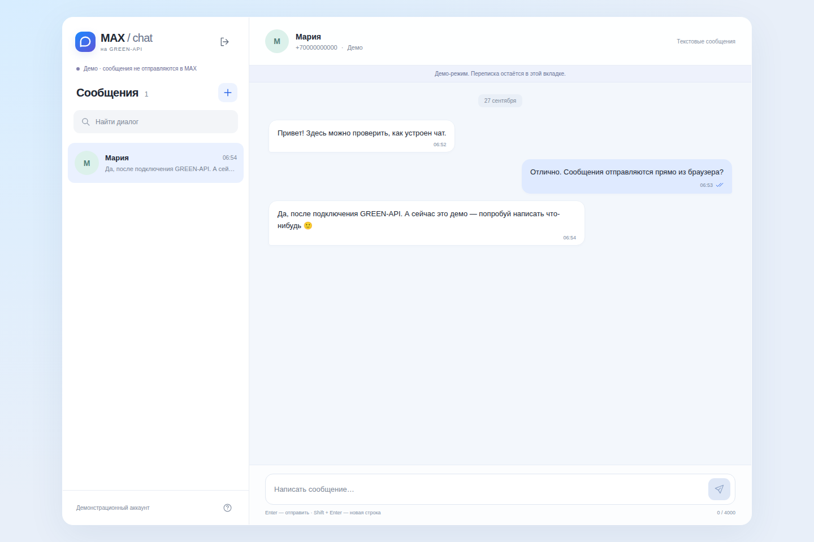

# MAX Chat · GREEN-API

Простой текстовый чат MAX на **React + TypeScript**, выполненный по тестовому заданию GREEN-API для фронтенд-разработчика.

**[Открыть приложение](https://ermahavwork.github.io/green-api-max-chat/)** · **[Локальный запуск и подключение](docs/SETUP.md)** · **[Проверки](docs/TESTING.md)**



## Возможности

- Вход с `idInstance`, `apiTokenInstance` и API URL из кабинета GREEN-API; проверка авторизации MAX.
- Создание чата по телефону через `checkAccount`: ответ собеседника приходит в тот же чат благодаря настоящему `chatId`.
- Отправка текста через `sendMessage`, до 4000 символов. Enter отправляет, Shift+Enter переносит строку.
- Получение обычного и расширенного текста через HTTP-очередь `receiveNotification` → обработка → `deleteNotification`.
- Дедупликация сообщений, статусы «Принято API» / доставки / прочтения / ошибки, восстановление polling с задержкой.
- Адаптивный интерфейс по мотивам MAX, поиск по чатам, счётчик непрочитанного, клавиатурная навигация.
- Отдельный **деморежим** без аккаунта и реальных сетевых отправок.

## Быстрый запуск

Нужен Node.js 22.12+ или 24 LTS и npm.

```bash
git clone https://github.com/ermahavwork/green-api-max-chat.git
cd green-api-max-chat
npm ci
npm run dev
```

Откройте адрес, показанный Vite, обычно `http://127.0.0.1:5173`. Нажмите **«Открыть демо»** или подключите свой инстанс MAX по [инструкции](docs/SETUP.md).

```bash
npm run build    # TypeScript + production build
npm test         # модульные и контрактные проверки
npx playwright install chromium
npm run test:e2e # браузерные сценарии с изолированной имитацией API
```

## Устройство проекта

| Файл | Назначение |
| --- | --- |
| `src/api.ts` | Типизированный HTTP-клиент, валидация адреса/телефона, очередь с backoff |
| `src/model.ts` | Чистые преобразования событий, объединение и дедупликация сообщений |
| `src/useChat.ts` | Жизненный цикл сессии, отправка, синхронизация и отмена запросов |
| `src/App.tsx` | Формы входа и нового чата, список диалогов, переписка |
| `src/styles.css` | Стили, адаптивность, focus и reduced-motion |
| `tests/` | Контрактные, модульные и браузерные тесты |

## Данные и ограничения

Токен хранится **только в памяти** до выхода/перезагрузки; не включается в сборку, URL приложения или browser storage. Браузер обращается непосредственно к HTTPS API GREEN-API. Токен присутствует в пути API-запросов по протоколу провайдера и доступен владельцу браузера в DevTools. Произвольные домены для отправки ключей запрещены. Аналитика и сторонние скрипты не подключены.

Переписка текущей вкладки хранится в `sessionStorage` отдельно для API URL и инстанса. Событие подтверждается после сохранения. Повторный вход после обновления страницы возвращает переписку; выход очищает её. Это не серверный архив: закрытие вкладки удаляет локальную историю. Приложение отображает сообщения, полученные во время работы; загрузка прежней истории из MAX не входит в задание.

Используйте отдельный тестовый инстанс. Чтение HTTP-очереди с подтверждением забирает события у других подключённых потребителей. При наличии Web Locks одна вкладка приложения читает очередь инстанса; другие ожидают освобождения блокировки. Между разными браузерами и устройствами блокировка не действует.

Отправка автоматически не повторяется: при сетевом сбое результат может быть неизвестен. Перед повтором нужно проверить MAX. HTTP 200 и `idMessage` означают принятие в очередь, а не доставку.

Живой обмен с MAX требует действующего инстанса и тестового получателя. Автоматические тесты используют имитацию официального API; результат живой проверки и ограничения описаны в [TESTING.md](docs/TESTING.md).

## Источники

Реализация написана для этого задания; код сторонних тестовых решений не включён. Протокол сверялся с официальной документацией:

- [Формат запросов](https://green-api.com/v3/docs/request-format/)
- [CheckAccount](https://green-api.com/v3/docs/api/service/CheckAccount/)
- [SendMessage](https://green-api.com/v3/docs/api/sending/SendMessage/)
- [HTTP API](https://green-api.com/v3/docs/api/receiving/technology-http-api/)
- [Входящий текст](https://green-api.com/v3/docs/api/receiving/notifications-format/incoming-message/TextMessage/)
- [Статусы](https://green-api.com/v3/docs/api/receiving/notifications-format/statuses/OutgoingMessageStatus/)
- [Визуальный ориентир MAX](https://web.max.ru/)

Автор: Андрей Ермохин. Предпочтительный формат работы — удалённый.

Это независимое тестовое приложение, не официальный клиент MAX или GREEN-API. Названия продуктов принадлежат их владельцам. Лицензия исходного кода: [MIT](LICENSE).
